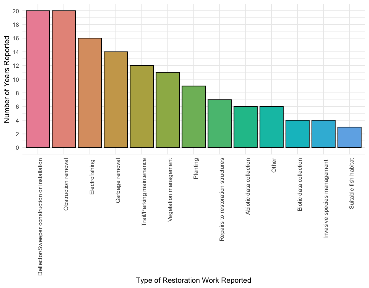

# mill-creek

## Overview
This repository hosts compiled data and analysis code for the report, "Biodiversity, cumulative effects, and the future of restoration in the Mill Creek Subwatershed," written by the University of Guelph BSc. Biodiversity Capstone Class of 2024 on behalf of the [Friends of Mill Creek (FoMC)](https://www.friendsofmillcreek.org/membership/sub-page-top/) community organization, with collaboration from the [Grand River Conservation Authority (GRCA)](https://www.grandriver.ca/).

## Data sources
Continuous data was sourced from the [GRCA Data Downloads](https://data.grandriver.ca/downloads-monitoring.html), including:
- water temperature (Aberfoyle and Side Road 10)
- water flow (Aberfoyle and Side Road 10)
- air temperature (Cambridge Shade's Mills)
- precipitation (Cambridge Shade's Mills)

Other abiotic data was sourced from GRCA document archives and publicly available monitoring reports. Surface water quality data was sourced from the [Government of Ontario's Provincial Water Quality Monitoring Network (PWQMN)](https://data.ontario.ca/en/dataset/provincial-stream-water-quality-monitoring-network) grab sample dataset (Side Road 10, collection site ID 16018413102). Friends of Mill Creek Stewardship Ranger data was sourced from compiled ranger reports. Biotic data was sourced from the [STREAM project](https://stream-dna.org/), GRCA document archives, and publicly available records.

## Organization
Scripts are located under the `code` folder. This includes:
- `air_temp.R` (summary analysis)
- `precip.R` (summary analysis)
- `water_temp.R` (summary analysis)
- `water_flow.R` (summary analysis)
- `mk_tests.R` (Mann-Kendall testing)
- `regressions.R` (regression modelling)
- `abiotic_graphing.R` (water quality, air temp, precipitation, water temp, and ranger restoration graphs)
- `biotic_graphing.R` (biotic inventory, STREAM, and trout graphs)

Data `.csv` and `.xlsx` files are organized under the `data` folder, with different sub-folders. All GRCA continuous monitoring data is represented by a raw data file, metadata file, and summarized data file with average metrics. Output figures are included under the `figures` folder, with different sub-folders. The supplemental material folder includes all supplemental documents for the capstone report, including the report itself.

## Running the code
All code for this repository was written in the R language, which is used to manipulate our data sets, describe the data, perform statistical analyses, and produce graphs. To run the code, clone the repo and open the `mill-creek.Rproj` file in R or RStudio. All required package installation and library code is included at the top of each script.

## Example figures

Proportion of entries in the ongoing biodiversity inventory, by Animal Class. The dashed vertical line separates vertebrate (Chordata) and invertebrate (outside Chordata) Classes. 

Type of restoration work completed by the Mill Creek Stewardship Rangers over the years, by frequency. 

Annual flashiness index values at the Aberfoyle (left) and Side Road 10 (right) gauge stations.

Daily average water temperature (C) at the Side Road 10 gauge station as a function of daily average air temperature (C) at the Cambridge Shade’s Mills Climate Station.