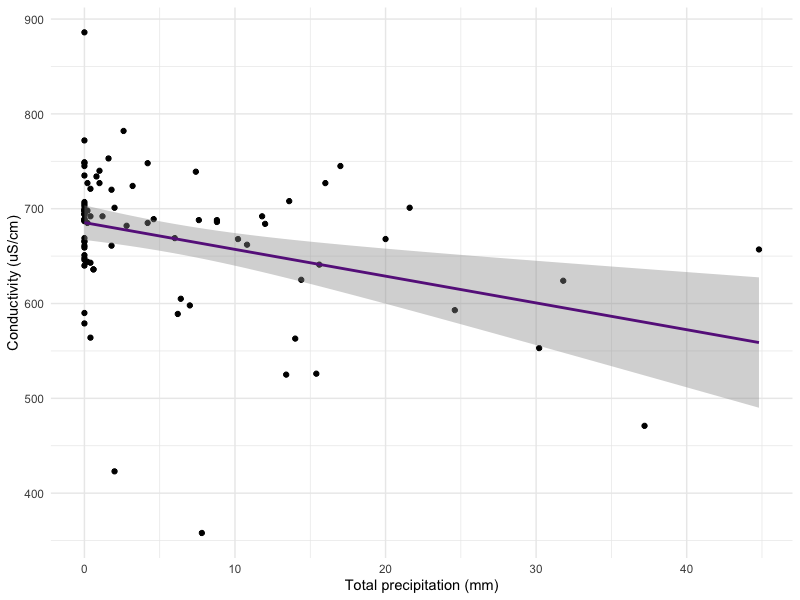

## Ammonium Model Assumptions

## Chloride Assumptions

## Conductivity Assumptions

## Conductivity by Precipitation

## Conductivity by Temperature

## Dissolved Oxygen Assumptions

## Dissolved Oxygen by Precipitation

## Log Chloride by Temperature

## Nitrate Assumptions

## Nitrate by Temperature

## Nitrite Assumptions

## Nitrite by Precipitation

## pH Assumptions

## pH by Temperature

## Phosphate Assumptions

## Phosphate by Precipitation

## Square Root Ammonium by Temperature

## Temperature Assumptions

## Water by Air Temperature
